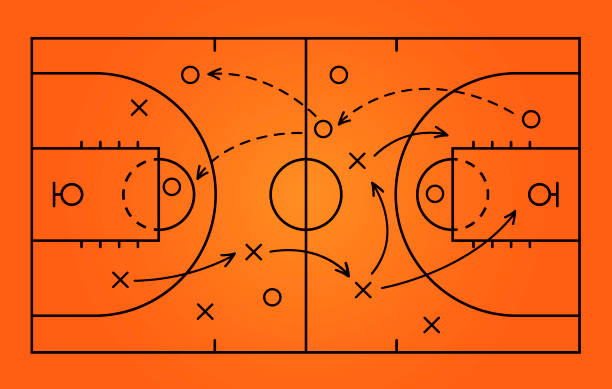

Imagine a basketball game in which each player is improvising their own moves without any plan. Players would clash and the game would, most certainly, become a huge mess. Now, consider the same game, but with a well-planned playbook. In this scenario, each player understands their position and role, the team works in harmony and executes plays that are meant to adapt to various scenarios. This is the difference that design patterns can make in software engineering. Design patterns turn random collections of code into a cohesive, efficient, and strategic system.

Like offensive and defensive schemes in a basketball playbook, design patterns in software engineering are tried-and-true solutions to common difficulties we face in software development. These are not fixed rules, but rather flexible guidelines that allow developers to "make the right read" and make better decisions.

# Creating My Playbook
When I was just starting my programming journey, I treated every coding challenge and design assignment as if I were creating new plays from scratch every time. Not only was this very unorganized, it was also very inefficient. I often had to write different sections of my code again and again, as if I were turning the ball over and had to restart the play again and again.

However, after many trials and errors, I was able to develop some plays in my own playbook as I started to learn more patterns and concepts. One pattern I learned, and was able to utilize in my playbook was the Observer Pattern, which defines a one-to-many dependency between objects so that when one object changes state, all of its dependents are notified and updated as well. 

I used the observer pattern in situations where there were many dependent objects on a single object. For example, if there were things I needed updated when a button was pressed. For example, I created a "sign up" form, where on the click of a buttom, an object would have to be updated based off the information the user put in the signup page.

# The Value of a Solid Playbook
Just like a well-designed basketball playbook ensures that a team can manage a variety of game situations, design patterns provide engineers with structured, reusable answers to common software difficulties. Learning and applying patterns such as the Observer Pattern has increased the productivity of my code while also making my projects more maintainable and scalable. By creating my own "playbook" of patterns and best practices, I can face new difficulties with confidence, knowing that I have the means to create cohesive and flexible systems. Design patterns, like great plays, help excellent developers become great ones.

