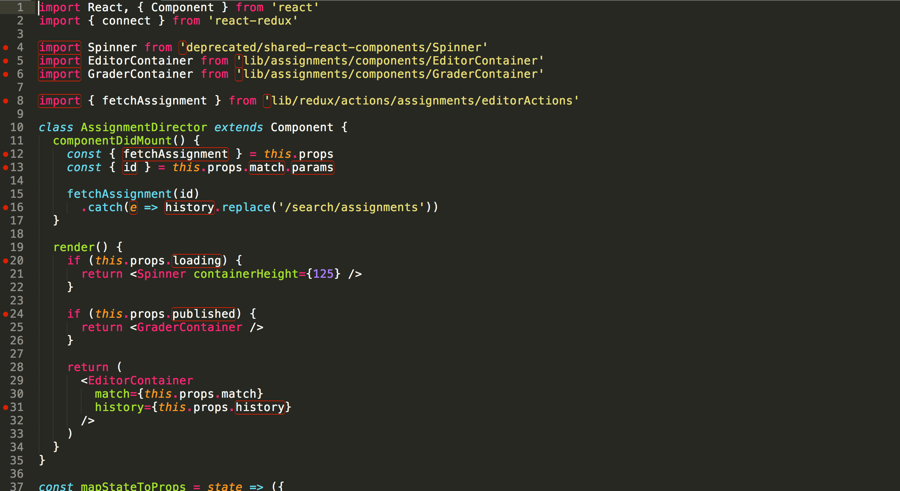

When I initially thought about coding standards, I pictured small details like how many spaces or indentations to use, where to place certain braces, how to name my functions/variables, and more. These things may seem unimportant, however they play a crucial role in improving the quality of our code and in making coding as a whole less overwhelming for newcomers to software engineering. Through my experience with ESLing and Visual Studio Code (VSCode), I was initially frustrated with the errors, but that soon turned in to appreciation for neat code that follows coding standards.

## Why Coding Standards Matter
Coding standards don’t just matter to make the code look good. Coding standards are especially important in making the code easier to read, maintain, and ultimately, collaborate on with others. When everyone that is working on the same code follows the same guidelines and standards, it makes it easier for everyone to understand and work on the code; it makes the whole process smoother. This can be especially helpful for new developers like myself and my peers in my Introduction to Software Engineering class. Things like consistent naming conventions and formatting can help us grasp the purpose of different variables and functions without having to overthink, which makes the whole process less overwhelming.

## My First Experience with ESLint and VSCode
When I was first introduced to ESLint and VSCode in my Intro to Software Engineering class, I felt completely overwhelmed and uncomfortable. The number of errors with every file I wrote was intimidating on top of the fact that I didn’t know how to deal with these errors at first. Sometimes, the errors were small, like adding a newline after the end of my code, but it took me a while to find and correct even these small errors. ESLint’s rules reminded me of a teacher I had in elementary school that would always tell me something was wrong with my work.

## A Shift in my Perspective
However, as I kept at it, I began to notice some positive changes. The struggle to fix all those ESLint errors gradually became an opportunity for me to learn and grow. With each correction, my code started to look cleaner and more organized. I began to understand and get used to ESLint’s standards and gradually made less errors and even spent less time fixing errors.
The more I used ESLint, the more I recognized the benefits of writing clean code. I started to appreciate how a consistent coding style made my code easier to read and understand, even through different files. 

## The Value of Clean Code
As I got more comfortable with ESLint, I started to see the bigger picture. Following coding standards wasn’t just about rules; it was about striving for quality in my work. Clean code is not only easier to debug but also simpler to build upon in the future.
Following standards also led me to make better design choices. When I focused on consistency and clarity, I found myself coming up with more efficient solutions to problems. This reflection ultimately improved my overall coding skills.
In summary, coding standards are far from trivial, they’re essential for effective software development. My experience with ESLint and VSCode taught me that while fixing errors can be challenging at first, the benefits are worth it. What started as a painful learning curve turned into a valuable lesson about the importance of clean code. As I continue to grow as a developer, I now see coding standards as a crucial tool that encourages growth, teamwork, and high-quality code.

