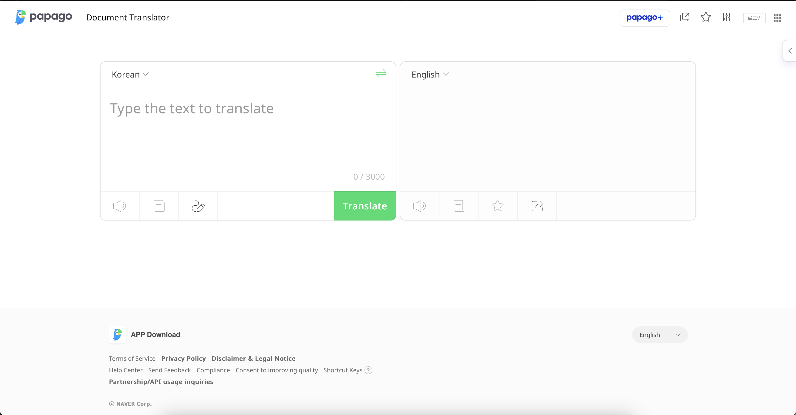
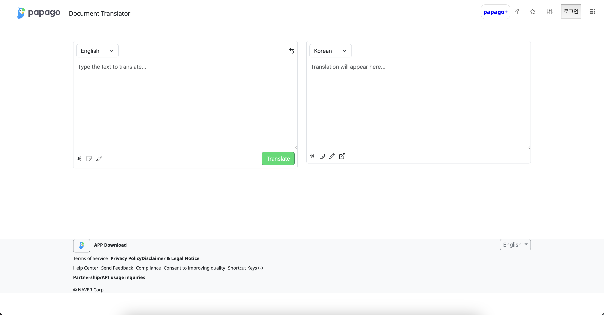

## The Challenge of Learning a UI Framework
When I first started my Intro to Software Engineering class at the University of Hawaii at Manoa, I had no idea that working with a UI framework like Bootstrap 5 would be so challenging. Having never worked with raw HTML and CSS before, I was unprepared for the complexity Bootstrap brought into the mix. But as we began our assignments, I quickly learned that using a UI framework was like learning a new language—full of potential but equally confusing and frustrating at first.

## Why Not Stick to Raw HTML/CSS?
Before jumping into Bootstrap, it seemed logical to wonder: Why not just stick with raw HTML and CSS? It’s simple, right? The truth is, while HTML and CSS give you complete control over every aspect of a website’s design, they can also become overwhelming when managing complex layouts, ensuring mobile responsiveness, or adding intricate design elements. Bootstrap solves these problems by providing pre-designed components, a flexible grid system, and responsive utility classes that save time and effort. You don’t have to reinvent the wheel; Bootstrap gives you the tools to create professional-looking sites right out of the box.

## A Frustrating but Rewarding First Experience
My first real test with Bootstrap came in the form of a website replica assignment. We had to choose an existing site and recreate it using Bootstrap 5. To say this assignment stressed me out would be an understatement. Bootstrap’s grid system, utility classes, and responsive design options felt overwhelming at first. I was constantly confused, and there were moments when I doubted I’d be able to finish the assignment in time. The frustration was real. Yet, by pushing through, I began to make progress. Though my replica wasn’t a perfect one-to-one match with the original site, the process forced me to learn how Bootstrap worked, especially the grid system and component classes.

## What Do We Gain from UI Frameworks?
The main advantage of UI frameworks like Bootstrap is that they significantly speed up the development process. Once you understand how to use the framework, you can build responsive, aesthetically pleasing websites with far less effort than manually coding everything in raw HTML/CSS. Bootstrap provides ready-made components, such as navigation bars, buttons, and grids, allowing for design consistency and cleaner code. And the framework's grid system ensures your site looks good across all screen sizes, something that would be tedious and time-consuming to handle manually with media queries.

## Conclusion: The Investment Pays Off
While the initial learning curve was steep, the investment of time and energy in learning Bootstrap 5 has already paid off. I now have a tool that simplifies many of the challenges of web development, from maintaining a consistent design to ensuring responsiveness. Bootstrap may have frustrated me at first, but it also empowered me to create better, more efficient websites. The benefits are clear: faster development, scalability, and a more professional final product. Though I’m still learning, Bootstrap has proven to be a valuable tool, and I’m excited to see how much further I can go with it.

