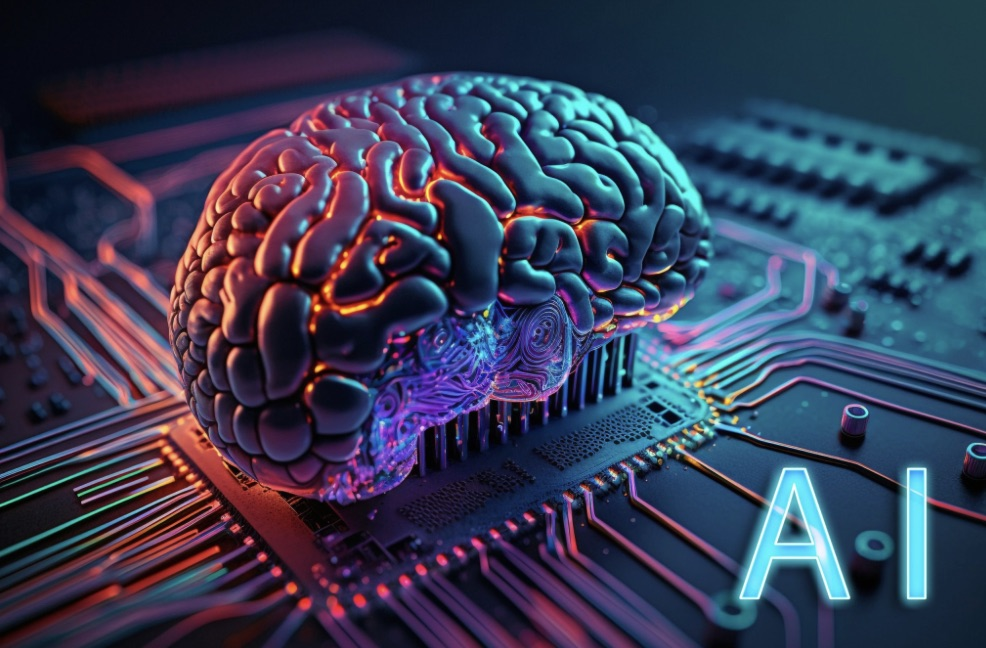

Artificial intelligence has played an increasingly important role in education, especially in software engineering. AI solutions like ChatGPT, GitHub Copilot, and Bard are being utilized more frequently to improve learning and efficiency. In ICS 314, an Intro to Software Engineering course, these tools helped students like myself to understand topics, and solve coding problems.Throughout the semester, I used AI tools in a variety of ways, including creating coding examples, troubleshooting issues, enhancing documentation, and improving the quality of my final project. This essay reviews my experiences with AI in ICS 314, including its advantages, limits, and overall impact on my learning journey.

# My Personal Experience with AI
Experience WODs:
I did not use AI for the Experience WODs because the lessons included video demos that were sufficient for me to understand what was needed.   Watching the videos taught me the steps firsthand, and using AI at that point seemed unnecessary.

In-class Practice WODs:
During in-class Practice WODs, I focused on understanding the learning the concepts without using AI. This was the period I focused on consciously improving my understanding so that I could perform well in graded WODs. I purposely avoided AI in order to assure that I could solve difficulties later on my own.

Essays:
For writing essays, I used ChatGPT to help refine grammar. For example, I would ask ChatGPT to read my essays and tell me if they flowed well or if there were any serious grammatical issues. However, all of the writing was my own ideas.

Final Project:
AI tools proved essential for the final project. When I had trouble styling a dropdown menu in my navbar with html, I asked ChatGPT, "How can I style a dropdown menu using html and CSS?" The AI gave me an example that helped me solve the problem quickly. Similarly, I utilized GitHub Copilot to autocomplete repetitious code, such as creating routes and functions.

Learning a concept / tutorial:
This was my primary usage of AI. I frequently used ChatGPT to explain complicated subjects in simpler words. For example, when initially learning html, I was confused on how the <a> tag worked. So, I asked ChatGPT, "Can you explain how the <a> tag works in HTML?" The AI broke the concept into simple, clear steps, and also provided examples, which improved my understanding a lot.

Answering a question in class or in Discord:
I did not use AI to answer questions in class or on discord and I preferred to rely on what I knew if i wanted to answer the questions. I felt it was important to contribute authentically or else the person asking the question would have asked AI themselves.

Asking or answering a smart-question:
When I needed to ask a smart question, I used ChatGPT to refine it so that I wouldn’t waste other people’s time. For instance, before asking on Discord, I would ask, “How can I ask a smart question about debugging a Node.js server error?” ChatGPT answered and helped me structure the question more effectively

Coding Example:
I used AI for coding examples when learning new concepts. For instance, I asked, “Give an example of using an tag in HTML with a target attribute.” This provided me with a clear and concise code snippet to test and understand.

Explaining code:
When I was initially learning frameworks like React, I often asked ChatGPT to explain pieces of code I didn’t understand. For example, I asked, “What does this React component do?” and pasted the code. The explanations were helpful in building my knowledge. I also used AI to explain error messages, such as, “What does the error 'undefined is not a function' mean in JavaScript?”

Writing Code:
I used GitHub Copilot to autocomplete functions and code blocks. For example, when building a function to validate user input, Copilot created a starting template. However, I took sure to thoroughly analyze the code to understand what it was doing.

Documenting code:
I sometimes used AI to ensure my code documentation was accurate and clear. For example, I asked ChatGPT, “How can I document this JavaScript functio?” The AI provided an example that I modified for my own needs.

Quality assurance:
AI was particularly helpful for quality assurance. When I encountered ESLint errors, I asked GitHub Copilot, “How do I fix this ESLint error: 'no-unused-vars'?” The AI explained the issue and provided a solution, which streamlined the debugging process.

# Impact on Learning and Understanding
The use of AI in ICS 314 has had a major effect on my learning. It helped me clarify complex topics, get clarity on frameworks, and improve my problem-solving skills. AI technologies like ChatGPT and GitHub Copilot saved me time on repetitive activities, allowing me to concentrate on more complex problem solving and comprehension. However, I saw the significance of combining AI aid with personal effort to ensure that I thoroughly comprehended the content.

# Practical Applications
Outside of ICS 314, I have used AI in small personal projects and simulations. For example, I built a basic to-do list application using React and sought help from ChatGPT when I encountered issues with state management. AI tools were also very essential when I was studying for exams or needed help with grammar on my essays. I would often ask ChatGPT questions such as, “Explain in simple terms, how I can solve RLC circuit problems for my physics class.”

# Challenges and Opportunities
While AI tools were useful, I encountered issues such as relying too heavily on GitHub Copilot, which occasionally produced code that did not meet my specific requirements. There were also cases where AI explanations were overly generic, requiring additional improvement.   Moving forward, there are chances to better integrate AI tools into the learning process, such as providing individualized feedback or tailored tutorials.

# Comparative Analysis
Traditional teaching methods, such as lectures and hands-on practice, remain essential for building foundational knowledge and skills. However, AI enhances these methods by providing instant support, examples, and explanations. AI tools increase engagement by enabling students to explore concepts interactively. For knowledge retention, combining traditional teaching with AI-driven learning ensures a balance between guided instruction and independent exploration.

# Future Considerations
The future of AI in software engineering education is promising. As AI technologies continue to advance, they have the potential to offer personalized learning paths, real-time feedback, and improved collaboration tools. However, challenges such as dependency on AI, ethical concerns, and ensuring students develop critical thinking skills must be addressed.

Reflecting on my use of AI in ICS 314, I found it to be a valuable tool for learning, problem-solving, and productivity. By using AI tools like ChatGPT and GitHub Copilot, I was able to overcome challenges, learn new concepts, and improve my coding skills. However, I also learned the importance of balancing AI assistance with independent effort to ensure deep understanding. Moving forward, AI will undoubtedly play a significant role in software engineering education, and optimizing its integration will benefit students and educators alike.

