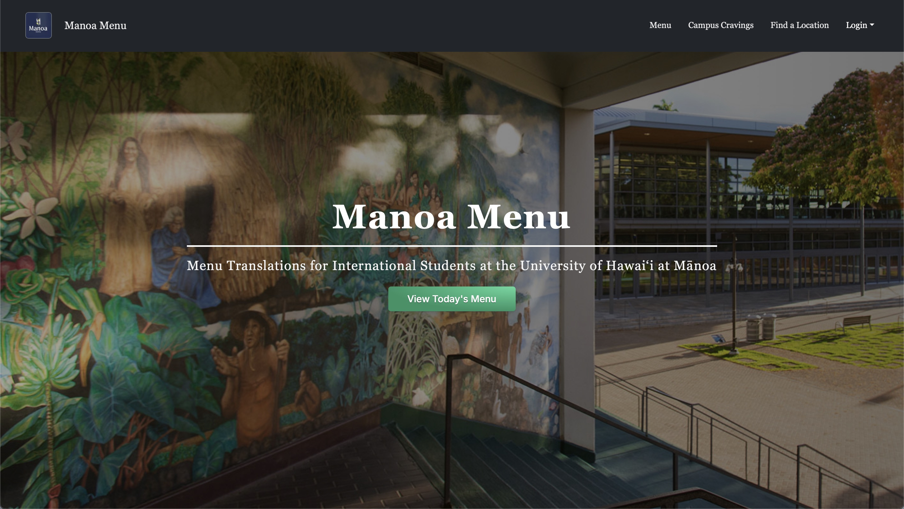

Team Homepage: [GitHub Organization](https://manoa-menu.github.io/)

Deployed Application: [Manoa Menu](https://manoa-menu.vercel.app)

Source Code: [Github Repo](https://github.com/manoa-menu/manoa-menu)

---

The Manoa Menu project is a web application designed to assist international students at the University of Hawaiʻi at Mānoa by providing menu translations and item descriptions for campus dining locations. The application allows users to view dining menus, find dining locations and hours, manage their favorite items, and receive personalized recommendations based on their preferences. It was developed to make dining on campus more accessible and enjoyable, especially for those facing language barriers.

As a frontend developer, I contributed to several critical aspects of the application. I designed and implemented a responsive navigation bar (navbar) that provides quick access to key features of the application. Additionally, I developed the sign-in, sign-up, sign-out, and change password pages with a focus on design consistency and accessibility. To ensure seamless functionality, I collaborated with the backend team to integrate these features with the user authentication system. I also worked on the user database by making minor updates to support authentication and password management.

Throughout the project, I attended every team meeting, actively contributing to discussions, brainstorming solutions to challenges, and collaborating with my teammates to meet deadlines. This teamwork helped ensure a cohesive user experience and alignment between frontend and backend development efforts.  
 
