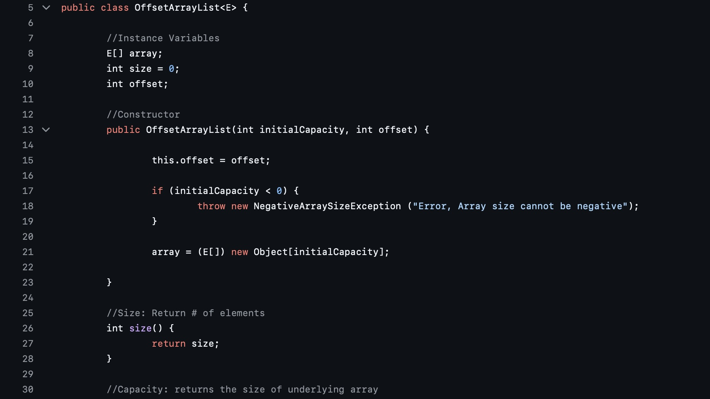

The `OffsetArrayList` project is a custom implementation of a resizable array list in Java with an added offset feature. This implementation allows users to specify an initial offset for indexing elements, which can be particularly useful in certain scenarios where the list’s logical indexing does not start from zero. The class provides a variety of methods to manage the list, including `add`, `remove`, `get`, `set`, and methods to retrieve the size, capacity, and offset of the list. The `add` method is designed to handle adding elements both at the end and at a specific index, while ensuring that the array is resized when necessary. The `remove` method handles the removal of elements and shifts the remaining elements accordingly.

In addition to the core functionality, the `OffsetArrayList` class includes a comprehensive unit testing method to validate its behavior under various conditions. This testing method checks for correct handling of edge cases, such as negative capacities, invalid indices, and verifies the correctness of the `toString` method by comparing its output to expected results. The `main` method demonstrates the basic usage of the `OffsetArrayList` by performing a series of operations and printing the results to the console, alongside running the unit tests to ensure that the implementation is working as intended.

See my full code here at my [GitHub Projects Respository.](https://github.com/erickimtypes/Projects)
